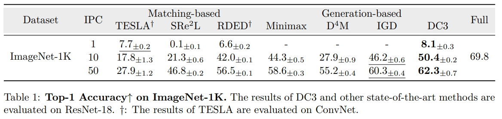

# DC3: Dataset Condensation with Color Compensation (TMLR)
[](https://arxiv.org/abs/2508.01139v1)
[](https://528why.github.io/DC3-Page/)


This is the DC3 framework we proposed. For more details, please see the [paper](https://arxiv.org/abs/2508.01139).

<!-- ## 📖 Project Overview

Dataset condensation always faces a constitutive trade-off: balancing performance and fidelity under extreme compression.
Existing methods struggle with two bottlenecks: image-level selection methods (Coreset Selection, Dataset Quantization) suffer from inefficiency condensation, while pixel-level optimization (Dataset Distillation) introduces semantic distortion due to over-parameterization.
With empirical observations, we find that a critical problem in dataset condensation is the oversight of color's dual role as an information carrier and a basic semantic representation unit.
We argue that improving the colorfulness of condensed images is beneficial for representation learning.
Motivated by this, we propose **DC3**: a **D**ataset **C**ondensation framework with **C**olor **C**ompensation.
After a calibrated selection strategy, DC3 utilizes the latent diffusion model to enhance the color diversity of an image rather than creating a brand-new one. 
Extensive experiments demonstrate the superior performance and generalization of DC3 that outperforms SOTA methods across multiple benchmarks.
To the best of our knowledge, besides focusing on downstream tasks, DC3 is the first research to fine-tune pre-trained diffusion models with condensed datasets.
The FID results prove that training networks with our high-quality datasets is feasible without model collapse or other degradation issues. -->

## 🎯 Key Contributions

- We propose DC3 that utilizes the compression ability as long as the generalization from different dataset condensation methods. It is a universal method that is adaptive to datasets of various scales and resolutions.

- Due to **Color Homogenization** inherent in pixel-level optimization methods, we employ the clustering-based quantization method to get rid of this issue and propose the diffusion-based **Color Compensation** method to enhance the information diversity of condensed images.

- In addition to the classification task, DC3 also dives into improving the fine-tuning performance of large vision models (LVMs). The FIDs on the fine-tuned stable diffusion and DiT demonstrate that the information is compressed and preserved by DC3.

- The experimental results, especially on the hard-to-classify datasets, demonstrate that DC3 achieves the superior performance of dataset condensation and enhances image colorfulness.


## 🏗️ Project Structure

```
DC3/
├── Submodular_Sampling/                  # Submodular sampling module
│   ├── submodular_sampling.py            # Main sampling script
│   ├── get_bins.py                       # Data binning processing
│   ├── scripts/                          # Running scripts
│   ├── util/                             # Utility functions
│   ├── submodular_sampler/               # Submodular sampler
│   └── dq/                               # Dataset quantization methods
├── Color_Compensation/                   # Color compensation module
│   ├── main.py                           # Main program entry
│   ├── compensation/                     # Compensation algorithm implementation
│   │   ├── DC3_ColorCompensation.py      # DC3 color compensation class
│   │   ├── handler.py                    # Model handler
│   │   └── utils.py                      # Utility functions
│   ├── validation/                       # Validation module
│   └── scripts/                          # Running scripts
├── requirements.txt                      # Dependency package list
└── README.md                             # Project documentation
```


## 🚀 Quick Start

### Requirements

- Python 3.8+
- CUDA 11.0+ (for GPU acceleration)


### Installation

```bash
# Clone the repository
git clone https://github.com/528why/Dataset-Condensation-with-Color-Compensation.git
cd Dataset-Condensation-with-Color-Compensation

# Create virtual environment
python -m venv dc3_env
source dc3_env/bin/activate  # Linux/Mac
# or
dc3_env\Scripts\activate     # Windows

# Install dependencies
pip install -r requirements.txt
```

## 📋 Usage

**Pre-trained Model Loading Paths**: Please search for "need to change" in the codebase to find and replace the pre-trained model loading addresses.

### 1. Submodular Sampling Stage

```bash
cd ./Submodular_Sampling

# Step 1: Generate clusters using K-means
python get_bins.py \
    --dataset CIFAR10 \
    --model ResNet18 \
    --batch 30 \
    --gpu 0 \
    --data_path /data/cifar10 \
    --save_path ./kmeans/cluster_cifar10_k_010 \
    --seed 42 \
    --K 10

# Step 2: Perform submodular sampling
python submodular_sampling.py \
    --IPC 10 \
    --K 10 \
    --dataset CIFAR10 \
    --data_path /data/cifar10 \
    --num_exp 10 \
    --workers 10 \
    -se 0 \
    --selection Submodular_sampler \
    --model ResNet18 \
    -sp ./submodular_sampler/cifar10_k_010_ipc_10 \
    --batch 128 \
    --submodular GraphCut \
    --submodular_greedy NaiveGreedy \
    --cluster_path ./kmeans/cluster_cifar10_k_010 \
    --pretrained
```

### 2. Color Compensation Stage

```bash
cd ../Color_Compensation

# Run color compensation
python3 main.py \
    --train_dir "/data/DC3/cifar10/train_by_class" \
    --dataset cifar10 \
    --ipc 10 \
    --combine_mode gradient \
    --indices_path "../Submodular_Sampling/submodular_sampler/cifar10_k_010_ipc_10/sample.npy"

# Follow RDED format for dataset storage structure
python get_dataset_by_class.py --dataset train  --ipc 10 --subset cifar10 --combine_mode gradient 
```

### 3. Validation Stage

```bash
cd ./validation

# Validate the condensed dataset
python main.py \
    --subset "cifar10" \
    --arch-name "resnet18_modified" \
    --factor 2 \
    --num-crop 5 \
    --mipc 300 \
    --ipc 10 \
    --stud-name "resnet18_modified" \
    --re-epochs 2000 \
    --syn_data_path "../../DC3_ColorCompensation/ipc10_train_by_class" \
    --val_dir "/data/cifar10/validation_by_class"
```

### Key Parameters

#### Submodular Sampling
- `--dataset`: Dataset name (CIFAR10, ImageNet, etc.)
- `--model`: Model architecture (ResNet18, ResNet50, etc.)
- `--IPC`: Images per class
- `--K`: Number of clusters for K-means
- `--submodular`: Submodular function (GraphCut, etc.)
- `--cluster_path`: Path to cluster results

#### Color Compensation
- `--train_dir`: Original training image directory
- `--dataset`: Dataset name
- `--ipc`: Images per class
- `--combine_mode`: Image combination mode (gradient, random, grid, fourfold_view)
- `--indices_path`: Selected indices path from submodular sampling

#### Validation
- `--subset`: Dataset subset name
- `--arch-name`: Architecture name for evaluation
- `--syn_data_path`: Path to synthesized condensed dataset
- `--val_dir`: Validation dataset directory


## 📊 Performance Comparison



## 📝 Citation

If you use DC3 in your research, please cite our paper:

```bibtex
@article{wu2025dataset,
  title={Dataset Condensation with Color Compensation},
  author={Wu, Huyu and Su, Duo and Hou, Junjie and Li, Guang},
  journal={Transactions on Machine Learning Research},
  year={2025}
}
```


<!-- ## 📄 License

This project is licensed under the MIT License - see the [LICENSE](LICENSE) file for details. -->

<!-- ## 📞 Contact

- Project homepage: [GitHub Repository](https://github.com/your-repo/DC3)
- Issue reporting: [Issues](https://github.com/your-repo/DC3/issues)
- Email: your.email@institution.edu -->

## 🙏 Acknowledgments

Our implementation references the code from [Dataset_Quantization](https://github.com/magic-research/Dataset_Quantization) and [RDED](https://github.com/LINs-lab/RDED). We extend our sincere gratitude to their team for their excellent work.

